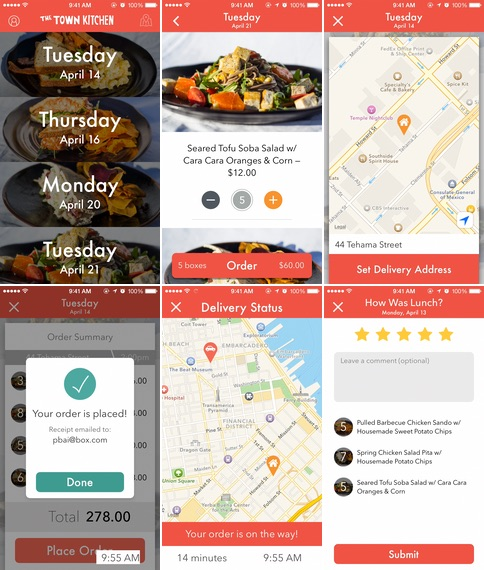

# The Town Kitchen

[The Town Kitchen](http://www.thetownkitchen.com) connects low-income Oakland youth with local chefs and artisans to plan, prepare, and deliver delicious curbside lunch.

This app allows Bay Area locals to easily order tasty meals, track deliveries in real-time, and provide instant feedback.

## Features
* Short intro tour
* Clean menu option ordering page
* Delivery map view for tracking order location
* Stripe integration for simple payment entry
* Email order confirmation through Mailgun
* Easy meal reviews following completed delivery
* Staff (driver) login for getting directions and delivering meals
* Custom navigation animation into each day's menu options

## Credits

* [AFNetworking](https://github.com/AFNetworking/AFNetworking)
* [FormatterKit](https://github.com/mattt/FormatterKit)
* [GoogleKit](https://github.com/maxsokolov/GoogleKit)
* [MBProgressHUD](https://github.com/jdg/MBProgressHUD)
* [MTAnimation](https://github.com/mysterioustrousers/MTAnimation)
* [Parse](https://parse.com/downloads/ios/parse-library/latest)
* [PaymentKit](https://github.com/stripe/PaymentKit)
* [pop](https://github.com/facebook/pop)
* [Stripe](https://github.com/stripe/stripe-ios)
* [SwipeView](https://github.com/nicklockwood/SwipeView)

